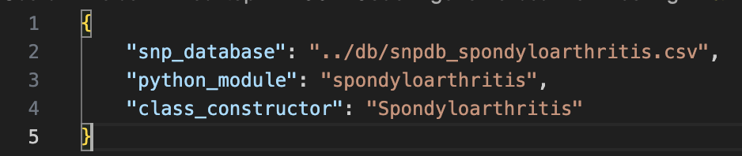

# genome-scanner
`genome-scanner` is an open source application to scan for Single Nucleotide Polymorphisms (SNPs) from users genetic testing data. 
Genetic testing data comes in different formats
* Variant Call Files (VCF) from Whole Genome Sequencing (WGS) data analysis (e.g., sequencing.com, dantelabs.com)
* Tab Separated Files (TSV) from DNA Genotyping (e.g., 23andme).

This application scans the user-provided files (can be downloaded from sequencing provider) for annotated genes from the SNP database and outputs a report table with associated risk or each found SNP. This application is an implementation of the findings in referenced papers for research purposes only. It is not recommended as guidance in medical diagnosis and treatment. There might be conflicting results from different studies, see referenced papers for more details.

Multiple conditions are implemented. Generic methods and attributes can be found in class Condition. Specific methods and attributes can be found in the corresponding child class (e.g. Spondyloarthritis). Each condition has their own SNP Database.

Example SNP Database for condition spondyloarthritis:\

Example report for condition spondyloarthritis based on VCF/TSV files:\

Example summary for condition spondyloarthritis:\
You will get a diagnostic and a treatment score for TNF inhibitors and Methotrexate based on all found genes (tsv version only).

# VCF Compatibility
This application has been tested with VCF v4.2 files. See https://samtools.github.io/hts-specs/VCFv4.2.pdf for details on file format. You can find example VCF files for individual genomes from the `International Genome Sample Resource (IGSR)` and the `1000 Genomes Project` at https://www.internationalgenome.org/faq/can-i-get-phased-genotypes-and-haplotypes-for-the-individual-genomes/.

# TSV Compatibility
This application has been tested with 23andme zip files containing TSV (text) files (one for each chromosome). See https://customercare.23andme.com/hc/en-us/articles/212196868-Accessing-Your-Raw-Genetic-Data for details on file format.

# Python Code
* Clone this repository to execute the application on your local computer installing the following [requirements](./requirements.txt).
* Add a new or edit an existing [SNP database](./db) to add more annotated genes.
* Run [genome-scanner_vcf.py](./code/genome-scanner_vcf.py) to execute this code on your local computer based on a VCF input file.
* Run [genome-scanner_tsv.py](./code/genome-scanner_tsv.py) to execute this code on your local computer based on a zip file containing TSV (txt) files. You need to provide at least the config file as the first command line parameter. In addition you can provide the user's SNP file as the second command line parameter. If the second command line parameter is not specified, the user's SNP file can be selected by an input dialog.

Example call for condition spondyloarthritis:\
python genome-scanner_tsv.py ../config/config_spondyloarthritis.json ../data/user_snp_23andme.zip

# Config file
A config file must contain key-value pairs for the following keys:
* snp_database: SNP database for specific condition
* python_module: Python module for specific condition
* class_constructor: class/constructor for specific condition.

Example config file for condition spondyloarthritis:\

  
