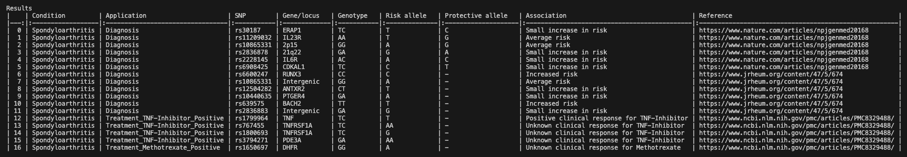

# genome-scanner

`genome-scanner` is an open source application to scan for Single Nucleotide Polymorphisms (SNPs) from Variant Call File (VCF) files that result from Whole Genome Sequencing (WGS) data analysis (e.g. sequencing.com, dantelabs.com).
It scans the user-provided VCF file (can be downloaded from sequencing provider) for annotated genes from the SNP database and outputs a report table with associated risk or each found SNP.
This application is an implementation of the findings in referenced papers for research purposes only. It is not recommended as guidance in medical diagnosis and treatment.

SNP Database\

Report based on VCF file\

# VCF File Compatibility
This application has been tested with VCF v4.2 files, see https://samtools.github.io/hts-specs/VCFv4.2.pdf for details on file format. You can find example VCF files for individual genomes from the `International Genome Sample Resource (IGSR)` and the `1000 Genomes Project` at https://www.internationalgenome.org/faq/can-i-get-phased-genotypes-and-haplotypes-for-the-individual-genomes/.

# Python Code
* Clone this repository to execute the application on your local computer using the following [requirements](./code/requirements.txt).
* Edit the [SNP database](./db/snpdb.csv) to add more annotated genes.
* Run [genome-scanner.py](./code/genome-scanner.py) to execute this code on your local computer.
  
# Web Service
Add hosted web service address
